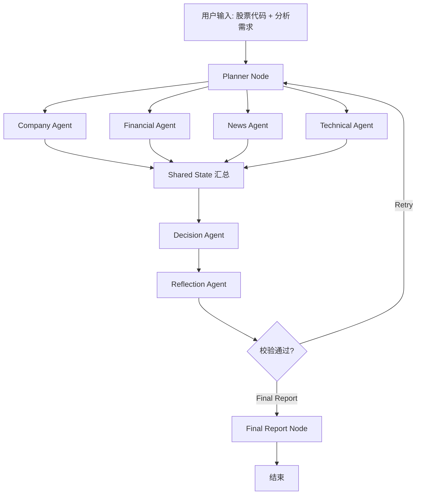

# LangGraph 股票多智能体系统开发蓝图

## 设计原则

本蓝图已按会议纪要 `股票多智能体系统总体架构设计.docx` 收敛为第一版 7 节点架构。

1. 第一版定位为“股票综合分析报告系统”，不做自动交易和真实下单。
2. LangGraph 只保留一个全局调度节点 `Planner Node`，避免多 supervisor 互相抢控制权。
3. 四个专业 Agent 并行采集和分析：Company、Financial、News、Technical。
4. 所有节点读写同一个全局 `State`，保证数据可追溯。
5. `Decision Agent` 只做中转汇总和初步风险评分，不负责原始信息采集。
6. `Reflection Agent` 负责专业校验，并决定走 `Retry` 还是 `Final Report`。
7. 每次运行都应支持 checkpoint、审计日志和断点续跑。

## 推荐状态结构

```python
from typing import TypedDict, Annotated
from langgraph.graph import add_messages

class StockAnalysisState(TypedDict, total=False):
    messages: Annotated[list, add_messages]
    run_id: str
    ticker: str
    user_request: str
    as_of_date: str
    retry_count: int
    max_retries: int

    planner_tasks: dict
    company_profile: dict
    financial_metrics: dict
    news_sentiment: dict
    technical_indicators: dict

    data_sources: list[dict]
    missing_items: list[str]
    decision_summary: dict
    reflection_result: dict
    final_report: str
    audit_log: list[dict]
```

## 推荐 Graph



## 节点职责

| 节点 | 输入 | 输出 | 说明 |
| --- | --- | --- | --- |
| Planner Node | ticker/request | planner_tasks | 拆解 4 类子任务，并控制 retry 补采 |
| Company Agent | planner_tasks | company_profile | 主营业务、行业赛道、股权结构、竞争地位 |
| Financial Agent | planner_tasks | financial_metrics | 年报/季报、净利润、ROE、资产负债率等 |
| News Agent | planner_tasks | news_sentiment | 政策、研报、新闻、利好利空舆情 |
| Technical Agent | planner_tasks | technical_indicators | K 线、成交量、MACD、PE/PB 等 |
| Decision Agent | shared state | decision_summary | 汇总四类结果，输出风险评分和初步研判 |
| Reflection Agent | decision + state | reflection_result | 校验完整性、逻辑矛盾、风险覆盖和缺失项 |
| Final Report Node | all state | final_report | 生成标准化股票综合分析报告 |

## 开发任务拆分

### M1: 会议架构接口冻结

- 固定 7 节点工作流。
- 固定 `StockAnalysisState`。
- 固定每个 Agent 的 JSON 输出 schema。
- 准备 2-3 只样例股票和报告模板。

### M2: Mock Demo 跑通

- 4 个专业 Agent 先用 mock 数据。
- 跑通并行采集、Decision 汇总、Reflection 校验。
- 验证 Retry 分支可以回到 Planner。

### M3: 真实数据接入

- Company Agent 接公司资料数据源。
- Financial Agent 接财报/财务指标数据源。
- News Agent 接搜索/RAG/新闻源。
- Technical Agent 接行情和技术指标计算。

### M4: Reflection 与报告质量

- Reflection 输出完整性评分、逻辑评分、风险覆盖评分。
- Final Report 采用固定模板。
- 报告包含来源、缺失项、风险提示和审计信息。

### M5: 批量分析与断点续跑

- 增加 LangGraph checkpoint。
- 支持多股票批量队列。
- 每只股票状态独立保存，失败后可恢复。

## 风险清单

- 信息泄漏：财报、新闻、指标窗口都要按 `as_of_date` 截断。
- 幸存者偏差：指数成分股回测要用当时成分，不要只用今天成分。
- 过拟合：不要用测试集反复选模型。
- LLM 幻觉：要求证据引用，不能让 LLM 编造数据。
- 成本失控：多 agent 需要缓存、并行和上下文裁剪。
- Retry 死循环：必须设置 `max_retries`，并让 Reflection 明确给出补采任务。

## 第一版 MVP 验收样例

输入：

```json
{
  "ticker": "AAPL",
  "as_of_date": "2026-06-30",
  "user_request": "请重点关注长期基本面和财务风险"
}
```

输出：

```json
{
  "decision_summary": {
    "risk_score": 62,
    "rating": "neutral",
    "summary": "基本面较强，但估值和短期波动需关注。"
  },
  "reflection_result": {
    "passed": true,
    "missing_items": [],
    "contradictions": []
  },
  "final_report": "标准化股票综合分析报告正文"
}
```

以上数字只是 schema 示例，不是投资建议。
