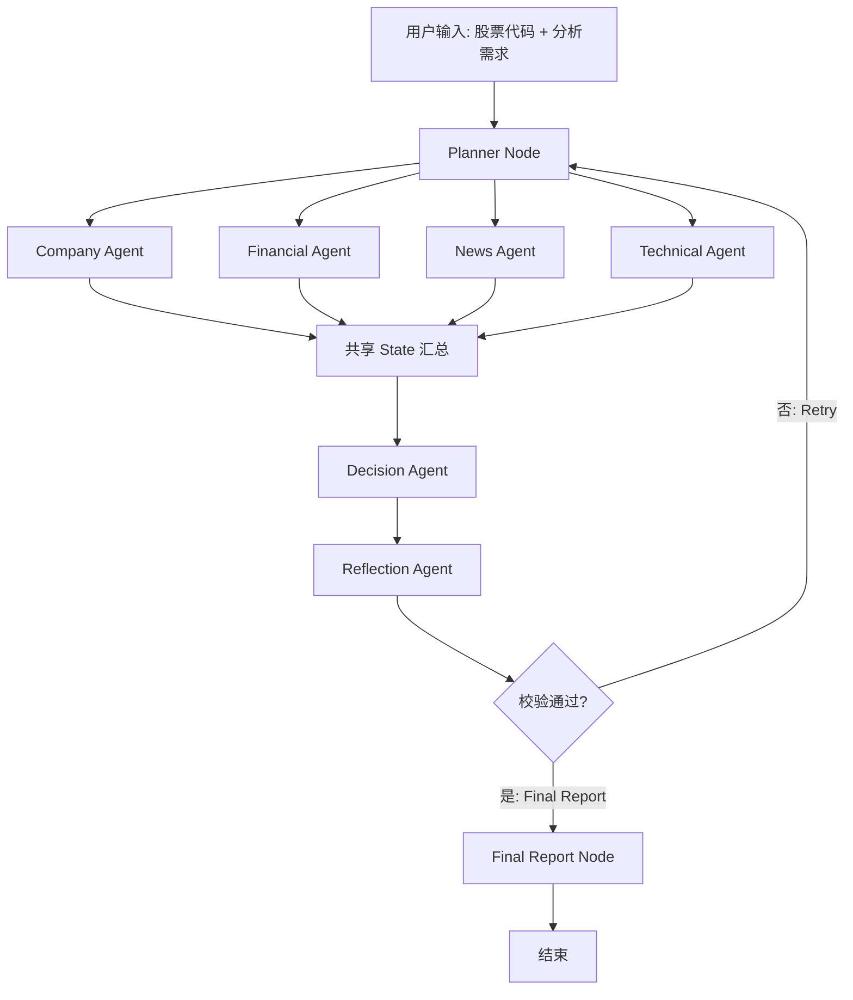

# 按会议纪要调整后的改进完善计划

来源会议纪要：`股票多智能体系统总体架构设计.docx`

## 1. 调整结论

现有学习与开发计划需要从“研究型多智能体 trading agent 泛化蓝图”收敛为会议纪要中的 7 节点固定架构：

1. `Planner Node`: 全局调度与任务拆解。
2. `Company Agent`: 公司基本面定性信息采集。
3. `Financial Agent`: 财报与核心财务指标计算。
4. `News Agent`: 政策、研报、新闻和舆情提取。
5. `Technical Agent`: K 线、成交量、MACD、PE/PB 等指标计算。
6. `Decision Agent`: 读取全局 State，输出初步风险评分和投资研判。
7. `Reflection Agent`: 校验完整性、逻辑矛盾、风险片面性和信息缺口。

工作流采用 `Retry` 与 `Final Report` 双分支闭环：校验不通过则回到 Planner 重新补采，校验通过则生成最终报告。

## 2. 与原计划的对应关系

| 会议纪要节点 | 原计划中的相关模块 | 调整方式 |
| --- | --- | --- |
| Planner Node | Data/Research supervisor | 保留为唯一调度入口，不再引入额外 supervisor |
| Company Agent | FundamentalAnalystAgent 的一部分 | 拆成公司画像与行业地位采集 |
| Financial Agent | FundamentalAnalystAgent 的量化部分 | 独立负责财务数据和指标计算 |
| News Agent | NewsSentimentAgent | 保留新闻/政策/研报/舆情采集与利好利空分类 |
| Technical Agent | TechnicalAnalystAgent + QuantSignalAgent | 先聚焦技术指标，不在第一版引入 DRL 交易模型 |
| Decision Agent | PortfolioManagerAgent | 调整为中转汇总节点，只输出初判和风险评分 |
| Reflection Agent | RiskManagerAgent + ReflectionAgent | 合并为专业校验节点，负责闭环重试判定 |

## 3. 第一阶段 MVP 范围

第一版只做“股票综合分析报告系统”，不做自动交易、不接 broker、不输出真实下单指令。

输入：

- 股票代码。
- 分析日期或默认当前日期。
- 个性化分析需求，例如“偏长期价值”“偏短线技术”“重点关注财务风险”。

输出：

- 公司基本面摘要。
- 财务指标摘要。
- 新闻舆情摘要。
- 技术指标摘要。
- 初步风险评分。
- 初步投资研判。
- Reflection 校验结果。
- 最终标准化分析报告。

## 4. LangGraph 工作流设计



## 5. 全局 State 字段建议

```python
class StockAnalysisState(TypedDict, total=False):
    run_id: str
    ticker: str
    user_request: str
    as_of_date: str
    retry_count: int
    max_retries: int

    planner_tasks: dict
    company_profile: dict
    financial_metrics: dict
    news_sentiment: dict
    technical_indicators: dict

    data_sources: list[dict]
    missing_items: list[str]
    decision_summary: dict
    reflection_result: dict
    final_report: str
    audit_log: list[dict]
```

## 6. Agent 输出 Schema

### Company Agent

```json
{
  "business_summary": "",
  "industry": "",
  "main_products": [],
  "competitive_position": "",
  "shareholder_structure": "",
  "key_risks": [],
  "sources": []
}
```

### Financial Agent

```json
{
  "revenue_growth": null,
  "net_profit_growth": null,
  "roe": null,
  "debt_to_asset": null,
  "gross_margin": null,
  "cash_flow_quality": "",
  "financial_risks": [],
  "sources": []
}
```

### News Agent

```json
{
  "positive_items": [],
  "negative_items": [],
  "policy_items": [],
  "broker_research_items": [],
  "sentiment_score": 0,
  "summary": "",
  "sources": []
}
```

### Technical Agent

```json
{
  "trend": "",
  "volume_signal": "",
  "macd_signal": "",
  "valuation_pe": null,
  "valuation_pb": null,
  "support_resistance": "",
  "technical_risks": [],
  "sources": []
}
```

### Decision Agent

```json
{
  "risk_score": 0,
  "rating": "neutral",
  "summary": "",
  "supporting_points": [],
  "risk_points": [],
  "missing_or_uncertain": []
}
```

### Reflection Agent

```json
{
  "passed": false,
  "completeness_score": 0,
  "logic_score": 0,
  "risk_coverage_score": 0,
  "missing_items": [],
  "contradictions": [],
  "retry_tasks": [],
  "review_comment": ""
}
```

## 7. 分工建议

| 模块 | 负责人角色 | 主要任务 | 交付物 |
| --- | --- | --- | --- |
| LangGraph 主流程 | 架构/后端 | State、Node、Edge、Checkpoint、Retry 路由 | `graph.py`、状态定义、流程测试 |
| Planner Node | Agent 工程 | 解析用户需求，生成 4 类子任务 | planner prompt + schema |
| Company Agent | 数据/LLM | 公司画像、行业、竞争地位 | company agent + 数据源适配 |
| Financial Agent | 量化/数据 | 财报接口、财务指标计算 | financial agent + 指标函数 |
| News Agent | RAG/检索 | 新闻、政策、研报、舆情分类 | news agent + 检索工具 |
| Technical Agent | 量化/行情 | 行情数据、MACD、成交量、PE/PB | technical agent + 指标函数 |
| Decision Agent | Agent 工程 | 汇总四类结果，生成初判 | decision prompt + schema |
| Reflection Agent | 评审/风控 | 完整性、矛盾、风险覆盖校验 | reflection prompt + retry 规则 |
| Final Report | 产品/后端 | 标准化报告模板 | report renderer |
| 测试与评估 | 测试/质量 | 节点单测、流程集成、样例股票集 | pytest + 样例报告 |

## 8. 开发里程碑

### M1: 文档与接口冻结

- 冻结 7 节点架构。
- 冻结 `StockAnalysisState`。
- 冻结各 Agent 输出 JSON schema。
- 产出 2-3 个样例输入和预期报告结构。

### M2: 串通无外部 API 的 Demo

- 使用 mock 数据实现 4 个专业 Agent。
- 跑通 Planner -> 并行 Agent -> Decision -> Reflection -> Final。
- 验证 Retry 分支能回流 Planner。

### M3: 接入真实数据

- Technical Agent 接入行情数据。
- Financial Agent 接入财务数据。
- News Agent 接入新闻/搜索/RAG。
- Company Agent 接入公司资料来源。

### M4: 校验与报告质量提升

- Reflection 增加完整性评分、矛盾检测、风险覆盖评分。
- Final Report 使用固定模板输出。
- 增加数据来源引用和审计日志。

### M5: 批量分析与断点续跑

- 增加 checkpoint。
- 支持批量股票队列。
- 支持失败恢复与每只股票独立状态保存。

## 9. 当前文档需要同步的地方

- `docs/langgraph_trading_agent_blueprint.md`: 已调整为会议纪要 7 节点优先。
- `docs/langgraph_multi_agent_learning_plan.md`: 学习计划增加“会议架构 MVP”优先级。
- `docs/research_and_code_analysis.md`: 保留 FinRL/TradingAgents/FinRL-X 分析，作为二期扩展参考。

## 10. 二期扩展建议

会议纪要第一版不建议加入自动交易和 DRL。等报告系统稳定后，再考虑：

- 用 FinRL/FinRL-X 增加回测验证节点。
- 将 Decision 输出扩展为目标权重。
- 增加 Risk Manager 硬规则风控。
- 增加历史决策记忆和后验表现反思。
- 增加多股票组合级分析。
