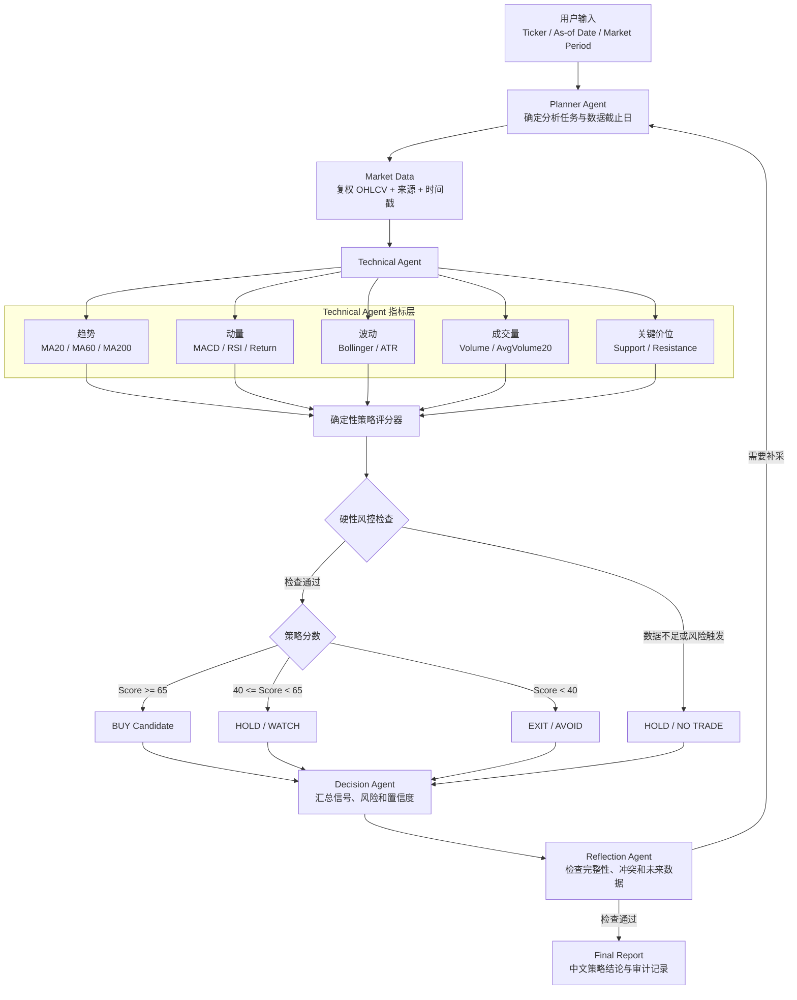

# 量化交易策略与 Technical Agent 规则设计计划书

## 1. 文档说明

- 项目：`multiple_agent_finance`
- 文档类型：策略研究与开发计划书
- 当前范围：量化策略分类、架构可视图、Technical Agent 交易规则设计
- 实施约束：本计划书不修改当前代码，不接入券商，不执行真实交易
- 目标市场：A 股股票，第一阶段使用日频 OHLCV 数据

本计划书基于当前项目的最小单链路：

```text
Planner -> Technical Agent -> Decision Agent -> Reflection Agent -> Final Report
```

当前 Technical Agent 已具备以下指标：

- 最新收盘价与成交量
- 20 日、60 日收益率
- MA20、MA60、MA200
- MACD、Signal、Histogram
- RSI14
- Bollinger Bands
- ATR14
- 20 日平均成交量
- 20 日支撑位与阻力位
- PE、PB 辅助字段

相关代码位置：

- `src/multiple_agent_finance/agents/technical.py`
- `src/multiple_agent_finance/tools/technical_tools.py`
- `src/multiple_agent_finance/agents/decision.py`
- `src/multiple_agent_finance/agents/reflection.py`
- `src/multiple_agent_finance/graph/builder.py`

## 2. 总体目标

第一阶段不追求复杂机器学习模型，而是建立一套：

- 指标可复算
- 条件可解释
- 无未来数据
- 风险可约束
- 结果可回测
- 决策可审计

的规则型量化交易策略。

推荐的第一版策略为：

```text
趋势过滤 + 动量确认 + 成交量确认 + 突破确认 + ATR 风险控制
```

Technical Agent 负责计算和解释市场事实；确定性策略规则负责生成候选信号；Decision Agent 负责汇总；Reflection Agent 负责检查数据、逻辑和风险。

## 3. 不在第一阶段实现的内容

- 高频交易
- Tick 级或盘口策略
- 自动实盘下单
- 融资融券与裸卖空
- 期权和期货策略
- 多股票组合优化
- 深度强化学习
- LLM 自由生成交易参数
- 根据单次回测结果自动调参

## 4. 量化交易策略分类

### 4.1 趋势跟踪策略

核心思想：

```text
价格趋势形成后可能持续一段时间
```

常用信号：

- 短期均线上穿长期均线
- 收盘价位于 MA20、MA60、MA200 上方
- MACD 金叉或柱状图转正
- ADX 确认趋势强度

优势：

- 规则明确
- 易于解释
- 适合中期趋势行情
- 与当前 Technical Agent 的指标最匹配

风险：

- 震荡行情中容易反复止损
- 信号有滞后
- 快速反转时回撤较大

当前项目适配度：高。

### 4.2 动量策略

核心思想：

```text
近期表现较强的资产可能在短期继续保持强势
```

常用信号：

- 20 日收益率
- 60 日收益率
- RSI
- MACD Histogram
- 相对指数强弱

优势：

- 能捕捉强势股延续
- 可与趋势策略组合

风险：

- 容易在情绪过热时追高
- 反转时损失较快
- 单只股票动量可能受事件冲击

当前项目适配度：高，但必须加入超买和波动过滤。

### 4.3 突破策略

核心思想：

```text
价格突破近期阻力并得到成交量确认后，可能进入新的趋势区间
```

常用信号：

- 突破前 20 日最高价
- 突破 Bollinger 上轨
- 成交量高于 20 日均量
- 突破后回踩不破

优势：

- 入场条件直观
- 可以过滤部分无趋势行情

风险：

- 假突破
- 涨停或大幅跳空后无法按预期价格成交
- 突破位计算包含当日数据时可能出现逻辑错误

当前项目适配度：高。

注意：当前 `support_resistance` 使用最近 20 日高低点。未来实现突破判断时，应使用“不包含当前交易日”的前 20 日最高价和最低价。

### 4.4 均值回归策略

核心思想：

```text
价格显著偏离均值后可能向均值回归
```

常用信号：

- RSI 超买或超卖
- 价格触及 Bollinger 上下轨
- Z-Score
- 价格偏离 MA20 的比例

优势：

- 在震荡市场中有效
- 交易周期较短

风险：

- 在强趋势中可能持续逆势
- 超卖不代表立即反弹
- 下跌股票可能长期保持弱势

当前项目适配度：中。

第一版只把均值回归指标作为风险过滤，不独立生成抄底信号。

### 4.5 多因子选股策略

核心思想：

```text
使用价值、质量、成长、动量、波动等多个因子对股票排序
```

常用因子：

- PE、PB
- ROE、现金流质量
- 营收和利润增长
- 20 日、60 日动量
- 波动率
- 成交量

优势：

- 适合股票池
- 能分散单一指标风险
- 可构建组合

风险：

- 需要横截面数据
- 需要处理行业中性和市值偏差
- 单只股票无法完成有效排名

当前项目适配度：中低。

应在 Company、Financial Agent 和多股票并行分析恢复后实施。

### 4.6 统计套利策略

核心思想：

```text
利用相关资产之间的统计关系偏离和回归获利
```

常见形式：

- 配对交易
- 协整策略
- 行业相对价值
- ETF 与成分股价差

优势：

- 可降低市场方向风险

风险：

- 相关性会失效
- 需要多资产同步数据
- 交易成本和执行要求高

当前项目适配度：低。

### 4.7 事件驱动策略

核心思想：

```text
围绕财报、回购、分红、并购、政策和重大公告进行交易
```

优势：

- 信号具有明确事件来源
- 可结合 News Agent 与 Financial Agent

风险：

- 发布时间对齐困难
- 事件影响可能提前反映
- 容易产生未来数据泄漏

当前项目适配度：暂不实施，待 News Agent 恢复后规划。

### 4.8 机器学习策略

核心思想：

```text
由模型学习指标与未来收益之间的非线性关系
```

可选模型：

- Logistic Regression
- Random Forest
- XGBoost
- LightGBM
- LSTM
- Transformer

优势：

- 可以整合大量特征
- 能学习非线性模式

风险：

- 过拟合
- 数据泄漏
- 特征漂移
- 可解释性下降
- 小样本下结果不可靠

当前项目适配度：第二阶段以后。

## 5. 策略选型矩阵

| 策略 | 当前指标是否满足 | 单只股票适用 | 日频适用 | 可解释性 | 第一阶段优先级 |
|---|---|---|---|---|---|
| 趋势跟踪 | 是 | 是 | 是 | 高 | P0 |
| 动量 | 是 | 是 | 是 | 高 | P0 |
| 突破 | 基本满足 | 是 | 是 | 高 | P0 |
| 均值回归 | 是 | 是 | 是 | 高 | P1，仅作过滤 |
| 多因子选股 | 不完整 | 否 | 是 | 中高 | P2 |
| 统计套利 | 否 | 否 | 是 | 中 | P3 |
| 事件驱动 | 不完整 | 是 | 是 | 中 | P2 |
| 机器学习 | 数据量不足 | 是 | 是 | 中低 | P3 |

## 6. 推荐的第一版策略

策略名称：

```text
Trend-Momentum-Volume Strategy
趋势动量成交量确认策略
```

核心逻辑：

1. 使用 MA20、MA60 判断中短期趋势。
2. 使用 MACD 确认动量方向。
3. 使用 RSI 排除极端追高和无确认抄底。
4. 使用成交量确认趋势或突破有效性。
5. 使用前 20 日阻力位确认突破。
6. 使用 ATR 控制入场、止损和仓位。
7. 数据不完整或指标冲突时输出 `HOLD`。

第一版默认只做多：

```text
BUY / HOLD / EXIT
```

不输出裸卖空指令。`SELL` 在第一版中仅代表退出已有多头仓位。

## 7. 工作架构可视图



## 8. Agent 职责边界

### 8.1 Technical Agent

负责：

- 从给定历史数据计算指标。
- 输出精确数值。
- 判断趋势、动量、成交量和波动状态。
- 标记数据不足。
- 提供数据来源和截止日期。

不负责：

- 自由修改策略阈值。
- 编造缺失价格。
- 直接决定真实下单数量。
- 根据叙述性偏好覆盖确定性规则。

### 8.2 确定性策略评分器

负责：

- 将指标转换为固定分数。
- 执行硬性过滤规则。
- 输出 `BUY_CANDIDATE`、`HOLD` 或 `EXIT`。
- 输出每个加分和扣分原因。

该层未来应实现为普通 Python 规则模块，不由 LLM 自由推理。

### 8.3 Decision Agent

负责：

- 汇总指标、分数和风险。
- 生成面向用户的解释。
- 给出策略评级和置信度。
- 明确区分事实、规则结论与不确定项。

### 8.4 Reflection Agent

负责检查：

- 数据截止时间是否正确。
- 是否存在未来数据。
- 指标是否完整。
- 交易规则是否执行一致。
- 风险条件是否被忽略。
- 信号与报告文字是否矛盾。

## 9. 数据要求

### 9.1 必需字段

```text
Date
Open
High
Low
Close
Volume
```

推荐使用前复权或后复权数据，但整个回测和生产流程必须保持一致。

### 9.2 数据长度

- 最低要求：60 个有效交易日。
- 推荐要求：至少 250 个有效交易日。
- MA200 不足时允许为空，但置信度必须下降。
- 少于 60 个交易日时不生成 `BUY`。

### 9.3 时间约束

- 所有指标只能使用 `as_of_date` 当日及之前的数据。
- 当日收盘后生成的信号，最早按下一交易日可成交价格回测。
- 不允许用当日收盘价生成信号后，再假设以同一收盘价成交。
- 新闻和财务数据未来接入后，必须使用真实发布时间而不是报告所属日期。

### 9.4 数据质量过滤

以下情况输出 `NO_TRADE`：

- OHLCV 为空。
- 最新数据日期晚于 `as_of_date`。
- 最新数据日期早于预期交易日过多。
- 价格或成交量为负数。
- 连续大量缺失。
- 复权方式前后不一致。
- 数据来源没有记录。
- `warnings` 包含无法确认的数据错误。

## 10. 第一版因子评分规则

基础分：

```text
50 分
```

分数范围：

```text
0 至 100
```

### 10.1 趋势因子

| 条件 | 分数 |
|---|---:|
| `Close > MA20 > MA60` | +20 |
| `Close < MA20 < MA60` | -20 |
| 均线顺序混乱 | 0 |
| `MA200` 存在且 `Close > MA200` | +5 |
| `MA200` 存在且 `Close < MA200` | -5 |

### 10.2 MACD 因子

| 条件 | 分数 |
|---|---:|
| MACD 为 bullish | +15 |
| MACD 为 bearish | -15 |
| MACD 为 neutral | 0 |
| MACD 为 unknown | 触发数据检查 |

后续增强项：

- Histogram 连续三日上升再额外加分。
- 金叉发生时间过久时降低权重。

### 10.3 RSI 因子

| RSI14 | 分数 | 解释 |
|---|---:|---|
| 45 至 65 | +10 | 健康多头动量 |
| 65 至 70 | +5 | 偏强但接近过热 |
| 70 至 75 | -5 | 追高风险增加 |
| 大于等于 75 | -15 | 极端超买 |
| 30 至 45 | -5 | 动量偏弱 |
| 小于 30 | 0 | 仅视为超卖，不直接抄底 |

RSI 超卖只有在趋势重新转强和 MACD 确认后，才允许成为候选反转信号。

### 10.4 成交量因子

定义：

```text
volume_ratio = latest_volume / avg_volume_20d
```

| 条件 | 分数 |
|---|---:|
| `volume_ratio >= 1.2` 且价格上涨 | +10 |
| `0.8 < volume_ratio < 1.2` | 0 |
| `volume_ratio <= 0.8` 且趋势为 bullish | -5 |
| 放量下跌 | -10 |

### 10.5 突破因子

定义：

```text
prior_resistance = 前 20 个交易日最高价，不包含当前日
prior_support = 前 20 个交易日最低价，不包含当前日
```

| 条件 | 分数 |
|---|---:|
| 收盘价突破 prior_resistance，且 volume_ratio >= 1.2 | +15 |
| 收盘价突破 prior_resistance，但未放量 | +5 |
| 收盘价跌破 prior_support | -20 |
| 未突破 | 0 |

### 10.6 波动因子

定义：

```text
atr_ratio = ATR14 / Close
```

| 条件 | 分数或操作 |
|---|---|
| `atr_ratio <= 0.025` | +5 |
| `0.025 < atr_ratio <= 0.04` | 0 |
| `0.04 < atr_ratio <= 0.06` | -10，降低仓位 |
| `atr_ratio > 0.06` | 禁止新开仓 |

具体阈值必须通过多股票、长周期回测验证，不能根据单只股票短期结果确定。

## 11. 信号映射

### 11.1 BUY Candidate

同时满足：

- 综合分数大于等于 65。
- 趋势不是 bearish。
- MACD 不是 bearish。
- RSI 小于 75。
- `atr_ratio` 不超过硬限制。
- 数据长度不少于 60 个交易日。
- 不存在关键数据警告。

输出：

```text
BUY_CANDIDATE
```

这是研究信号，不代表真实下单。

### 11.2 HOLD / WATCH

任一情况：

- 分数在 40 至 64。
- 趋势与动量冲突。
- 突破没有成交量确认。
- RSI 过热。
- 数据质量一般但仍可分析。
- 已持仓且退出条件未触发。

输出：

```text
HOLD
```

### 11.3 EXIT / AVOID

任一情况：

- 综合分数低于 40。
- 收盘价跌破前 20 日支撑。
- `Close < MA20 < MA60`。
- MACD bearish 且趋势 bearish。
- 已持仓时触发止损。

输出：

```text
EXIT
```

未持仓时解释为 `AVOID`。

### 11.4 NO TRADE

用于数据或执行条件不满足：

- 指标不足。
- 日期不一致。
- 数据源异常。
- 停牌或无法成交。
- 市场规则检查失败。

输出：

```text
NO_TRADE
```

## 12. 风险管理规则

### 12.1 单笔风险预算

建议初始研究参数：

```text
单笔最大风险 = 账户净值的 0.5%
单只股票最大资金占用 = 账户净值的 20%
```

以上仅作为回测起点，不作为收益承诺。

### 12.2 初始止损

候选方法：

```text
ATR 止损 = Entry Price - 2 × ATR14
结构止损 = prior_support
最终止损 = 两者中更接近入场价、且低于入场价的有效价格
```

如果无法得到有效止损价格，则禁止开仓。

### 12.3 仓位计算

```text
risk_amount = account_equity × risk_per_trade
stop_distance = entry_price - stop_price
raw_shares = risk_amount / stop_distance
```

再根据以下条件取较小值：

- 单只股票资金上限。
- 可用现金。
- 市场最小申报单位。
- 当前股票和板块的交易规则。

### 12.4 移动止损

第一版建议：

```text
trailing_stop = highest_close_since_entry - 2.5 × ATR14
```

移动止损只能上调，不能下调。

### 12.5 退出优先级

1. 数据或交易状态异常。
2. 硬止损。
3. 跌破 prior_support。
4. 趋势转为空头。
5. MACD 与趋势同时转弱。
6. 移动止损。
7. 评分降至退出阈值。

## 13. A 股执行约束

策略层不应把所有交易规则写死，应由执行配置按以下维度读取：

- 上海证券交易所或深圳证券交易所。
- 主板、科创板、创业板等板块。
- 普通股票、风险警示股票等证券状态。
- 最小申报数量。
- 价格涨跌幅限制。
- 停牌状态。
- 当日买入证券的可卖时间限制。
- 佣金、税费、过户费和滑点。

回测必须遵循：

- 信号日和成交日分离。
- 无法成交时保留未成交状态，不能强制按理论价格成交。
- 交易费用参数化。
- 涨跌停、停牌和流动性不足时模拟真实不可成交。

交易规则应以交易所最新现行规则为准：

- 上海证券交易所交易规则（2026 年修订）：https://www.sse.com.cn/lawandrules/sselawsrules2025/stocks/exchange/c/c_20260424_10816482.shtml
- 深圳证券交易所交易规则（2026 年修订）：https://docs.static.szse.cn/www/lawrules/rule/trade/current/W020260424690713155663.pdf

## 14. 建议输出结构

未来策略结果建议采用以下结构，便于 Decision 和 Reflection 使用：

```json
{
  "ticker": "002230.SZ",
  "as_of_date": "2026-04-15",
  "strategy_name": "trend_momentum_volume_v1",
  "signal": "BUY_CANDIDATE",
  "score": 72,
  "hard_filters_passed": true,
  "factor_scores": {
    "trend": 25,
    "macd": 15,
    "rsi": 5,
    "volume": 10,
    "breakout": 15,
    "volatility": 2
  },
  "entry_reference": null,
  "stop_reference": null,
  "position_risk_pct": 0.5,
  "reasons": [],
  "risk_flags": [],
  "warnings": [],
  "sources": []
}
```

`entry_reference` 和 `stop_reference` 只能来自行情和规则计算，不能由 LLM 猜测。

## 15. Reflection 检查清单

### 15.1 数据完整性

- OHLCV 是否存在。
- 数据是否截止到 `as_of_date`。
- 是否至少有 60 个交易日。
- MA、MACD、RSI、ATR、成交量是否可计算。
- 数据源是否记录。

### 15.2 逻辑一致性

- bullish 趋势与均线关系是否一致。
- MACD 标签与数值是否一致。
- RSI 标签与数值是否一致。
- volume_signal 与 volume_ratio 是否一致。
- support 是否低于 resistance。
- 突破判断是否排除了当前日。

### 15.3 交易信号一致性

- BUY 是否满足分数和硬性条件。
- EXIT 是否有明确触发项。
- NO_TRADE 是否被 Decision 错写成 BUY。
- 报告中的数值是否全部来自 `market_snapshot`。

### 15.4 风险一致性

- ATR 过高时是否禁止或降低仓位。
- 止损是否低于入场参考价。
- 仓位是否超过资金上限。
- 是否考虑不可成交状态。

## 16. 回测方案

### 16.1 数据范围

推荐：

- 至少 5 年日频数据。
- 包含上涨、下跌和震荡阶段。
- 至少选择 10 至 30 只不同科技股进行稳健性验证。
- 最后 12 个月作为独立样本外测试。

单只股票短区间只能用于链路可行性验证，不能用于确认策略有效性。

### 16.2 对照策略

- Buy and Hold。
- MA20/MA60 简单交叉。
- MACD 单指标策略。
- RSI 均值回归策略。
- 当前组合策略。

### 16.3 回测成交假设

- 使用下一交易日开盘价或可配置成交模型。
- 纳入手续费、税费和滑点。
- 模拟停牌和价格限制。
- 不允许未来数据。
- 参数在样本外测试前冻结。

### 16.4 评估指标

- 累计收益率。
- 年化收益率。
- 最大回撤。
- 夏普比率。
- Calmar Ratio。
- 胜率。
- 盈亏比。
- Profit Factor。
- 换手率。
- 交易次数。
- 持仓时间。
- 资金利用率。

### 16.5 技术验收标准

必须满足：

- 同一输入始终产生相同信号。
- 每个信号可以追溯到指标和规则。
- 不存在未来数据。
- 缺失数据不会生成 BUY。
- 交易成本可以配置。
- 回测和报告使用同一策略版本。
- 所有阈值有版本号和审计记录。

性能目标不作为硬编码验收条件。若策略只在一只股票或一个短区间有效，应判定为过拟合风险，而不是上线依据。

## 17. 测试用例计划

### 17.1 趋势测试

- `Close > MA20 > MA60` 应产生趋势加分。
- `Close < MA20 < MA60` 应产生趋势扣分。
- 均线为空时应触发数据检查。

### 17.2 动量测试

- MACD bullish 应加分。
- MACD bearish 应扣分。
- RSI 大于等于 75 不应产生追高买入。
- RSI 小于 30 不应单独产生抄底买入。

### 17.3 成交量与突破测试

- 放量突破前 20 日高点应产生突破加分。
- 缩量突破只能小幅加分。
- 跌破前 20 日低点应触发退出。
- 当前日最高价不能参与 prior_resistance 计算。

### 17.4 波动和仓位测试

- ATR 比例超过硬限制时禁止新开仓。
- 止损距离为零或负数时禁止计算仓位。
- 计算仓位不能超过资金上限。

### 17.5 时间测试

- `as_of_date` 之后的数据必须被过滤。
- 信号不能按同日收盘价成交。
- 数据时间戳不完整时输出警告。

### 17.6 A 股执行测试

- 停牌状态不能成交。
- 无成交量不能成交。
- 价格限制状态按配置模拟。
- 申报数量按交易所和板块规则处理。

## 18. 开发阶段计划

### 阶段 0：规则冻结

目标：

- 确定指标定义。
- 确定评分表。
- 确定硬性过滤条件。
- 确定成交和费用假设。

交付物：

- 策略规格文档。
- 指标数据字典。
- 策略版本号 `trend_momentum_volume_v1`。

### 阶段 1：信号层

未来开发任务：

- 增加 prior_support 和 prior_resistance。
- 增加 volume_ratio。
- 增加 atr_ratio。
- 增加确定性 factor_scores。
- 增加 signal 字段。

### 阶段 2：风险层

未来开发任务：

- 止损计算。
- 仓位计算。
- A 股交易约束配置。
- 不可成交状态。

### 阶段 3：回测层

未来开发任务：

- 下一交易日成交。
- 费用和滑点。
- 持仓状态。
- 基线对比。
- 指标统计。

### 阶段 4：Agent 协作

未来开发任务：

- Decision 读取确定性信号而不是重新发明规则。
- Reflection 执行一致性检查。
- Final Report 展示因子分数、触发条件和风险。

### 阶段 5：模拟盘

未来开发任务：

- 每日定时生成信号。
- 记录实际可成交价格。
- 对比回测假设与模拟结果。
- 只生成建议，不自动下单。

## 19. 风险与控制措施

| 风险 | 控制措施 |
|---|---|
| 未来数据泄漏 | 强制 `as_of_date` 截断，信号日与成交日分离 |
| 单股票过拟合 | 扩展股票池和市场阶段 |
| LLM 编造数值 | 精确数值只来自 Technical 工具 |
| 参数过拟合 | 参数冻结、样本外验证 |
| 假突破 | 成交量和 ATR 联合过滤 |
| 震荡反复交易 | 趋势过滤、最小持有期研究、成本回测 |
| 涨跌停或停牌 | 执行层模拟不可成交 |
| 数据源异常 | warnings、来源记录、NO_TRADE |
| 交易规则变化 | 交易所规则配置化，不写死 |
| 短回测误判 | 至少五年数据和独立样本外区间 |

## 20. 最终建议

当前项目最适合先完成：

```text
趋势 + MACD + RSI + 成交量 + 突破 + ATR
```

不建议第一步直接使用深度学习或强化学习。当前最重要的不是提高模型复杂度，而是建立：

- 正确的数据截止机制。
- 确定性的交易规则。
- 可复现的信号。
- 真实的成交约束。
- 完整的风险和回测框架。

当规则型策略能够跨股票、跨周期稳定运行后，再增加基本面、新闻、多因子和机器学习模块，才能明确判断新增 Agent 或模型是否真正带来增量价值。
